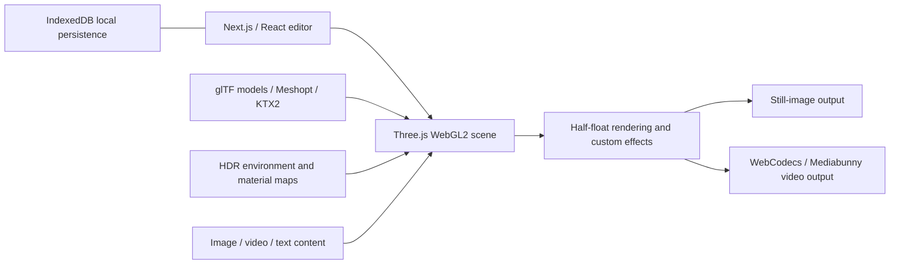

# UltraMock technical dossier and mok comparison

**Research snapshot: September 6, 2026, EDT. UltraMock 2.45.0; mok application baseline c316d05.**

The main finding is that mok already uses the right broad technology. UltraMock's advantages are more plausibly in prepared assets, material calibration, light composition, resource handling and interaction details than in an undiscovered replacement renderer. This scan identifies concrete differences to work on; it does not establish identical output or reveal every private tool the maker uses.

This dossier combines live editor inspection, official product information, public delivery/library fingerprints, metadata-only inspection of two free models and three supporting assets, and a source/asset audit of mok. Companion documents contain the [detailed local rendering audit](mok-rendering-audit.md), [prioritized implementation plan](mok-improvement-plan.md), and [parsed public asset metadata](ultramock-asset-metadata.json). The underlying application baseline is [c316d05 on GitHub](https://github.com/newomp4/mok/tree/c316d05c3c5fc1aa3abbc307ccb41775af1adf5f).

## What matters most for your tool

| Finding | UltraMock evidence | mok today | Practical consequence |
| --- | --- | --- | --- |
| Same graphics family | Three r183 / WebGL2 | Three r185 / WebGL2 | Keep the core renderer; changing engines is not supported by this evidence |
| Sharper environment source | Inspected studio HDR is 2048×1024 | Six HDR sources are 1024×512 | Test licensed 2K originals with a 1K fallback and matched exposure |
| GPU texture preparation | Free models use Basis/KTX2; concrete maps use UASTC, full mips and correct transfer functions | Models use WebP, despite an available KTX2 loader | Introduce a validated compression/material pipeline, measuring quality and GPU cost |
| Authored material detail | Two inspected models have many separate materials and texture assets | Quality and map coverage vary across ten imported models | Calibrate metal, glass, keys and rubber per model; obtain better source assets where needed |
| Screen/keyboard interaction | Publicly announced screen illumination and geometric display reflections | Both display mirrors and screen-driven deck light/reflection are already implemented | Improve calibration and occlusion only after matched visual tests; this feature is no longer missing |
| Motion and color | Exact reference integration unknown | Motion-blur samples are averaged after tone mapping | Move accumulation into linear light before the final output transform |
| Long/high-resolution output | Native browser media tooling confirmed; reference peak memory unknown | In-memory muxing and expensive full-size MSAA combinations | Add explicit memory planning, streaming output and bounded caches |
| Small workflow differences | Screen padding; configurable paste routing; dedicated workflow tours | Those controls/workflows are absent | Fill these specific gaps rather than adding more superficially similar effect names |

The first two asset facts are directly supported by the linked metadata sources below. The motion-blur and memory findings come from mok's code, not assumptions about UltraMock. More texture pixels, meshes or libraries are not quality scores by themselves.

## Technology relationship

This is a conceptual map of publicly established components, not UltraMock's recovered internal call graph.

mok adds React Three Fiber, Drei and the pmndrs postprocessing package around the same broad scene/media model. Those abstractions are not evidence of inferior output. The detailed audit tracks where mok's own rendering and memory choices matter.

## How confident these findings are

**Observed** means a visible control, public header, explicit version declaration or parsed asset field. **Fingerprint** means distinctive shipped library identifiers without a complete manifest. **Announced** means the maker describes the capability; execution is unverified. **Inference** is a reasoned interpretation, labeled as such. **Unknown** is not the same as absent.

The scan covered publicly accessible delivery paths and free editor controls. It did not purchase a plan, invoke private APIs, retrieve protected models, inspect source maps, create accounts or copy proprietary implementation into mok. Some browser sessions were already signed in; private account identifiers are excluded. New image upload in this pass was blocked by the Chrome extension's file-access setting, so controlled new UltraMock source/render comparisons remain incomplete. That does not affect the version, metadata or UI observations.

Previous mok checks recorded 100 passing tests plus real PNG/MP4 inspection. This research pass reviewed source and documentation; it did not rerun that application suite or benchmark UltraMock's GPU. The implementation plan is proposed work, not a claim that those improvements have shipped.

## Framework, UI, and delivery

| Component | Finding | Evidence and confidence |
| --- | --- | --- |
| Hosting/CDN | Vercel | Public homepage response: `server: Vercel`, `x-vercel-cache: HIT`, `x-vercel-id`; independently maker-listed on [Product Hunt Built with](https://www.producthunt.com/products/ultramock/built-with). |
| Web framework | Next.js **15.5.18**, App Router/RSC | Public [runtime chunk](https://www.ultramock.io/_next/static/chunks/3284-cc45182ed8151748.js) declares Next version and appDir. Headers include `x-nextjs-prerender: 1` and `vary: rsc, next-router-state-tree, next-router-prefetch, next-router-segment-prefetch`. |
| UI runtime | React and React DOM **19.2.0-canary-0bdb9206-20250818** | Explicit version declarations in the [React runtime chunk](https://www.ultramock.io/_next/static/chunks/3284-cc45182ed8151748.js) and [React DOM runtime chunk](https://www.ultramock.io/_next/static/chunks/4bd1b696-fa6862eda8c97680.js). This is the deployed runtime, not a recommendation to adopt a canary. |
| Bundler | Webpack | Public [Webpack runtime](https://www.ultramock.io/_next/static/chunks/webpack-697db5c1b2015331.js), code-split hashed chunks and dynamically loaded editor. |
| CSS | Tailwind CSS **4.2.2** | Preserved license/version banner in [stylesheet](https://www.ultramock.io/_next/static/css/ac59162871453ad5.css). |
| App fonts | Geist and Geist Mono, self-hosted WOFF2 | [Font stylesheet](https://www.ultramock.io/_next/static/css/e0c1431de24f285e.css), variable weight 100–900, font-display swap, font preloads in public HTML. |
| Icons | Lucide | Distinctive SVG/class fingerprint in [UI/media chunk](https://www.ultramock.io/_next/static/chunks/3242.e424b3ad7aeb1525.js). Exact package version unknown. |
| UI primitives | Radix UI context menu | Same chunk contains `--radix-context-menu-content-transform-origin` and Radix popup variables. Exact version and full package set unknown. |
| UI animation | Motion / Framer Motion family | Same chunk contains Motion projection/layout and `data-framer-portal-id` fingerprints. Version and exact package entry point unknown. This does **not** establish that the camera timeline is implemented in Framer Motion. |
| Legacy browser polyfills | core-js **3.38.1** fingerprint | [Public polyfills bundle](https://www.ultramock.io/_next/static/chunks/polyfills-42372ed130431b0a.js). |
| Analytics | Vercel Analytics **2.0.1**, DataFast cookieless script | [Layout chunk](https://www.ultramock.io/_next/static/chunks/app/layout-4c549d060f5be9fb.js) declares `@vercel/analytics` SDK version and loads [DataFast cookieless script](https://datafa.st/js/script.cookieless.js). |
| Error reporting | Sentry JavaScript SDK **10.47.0**, Next.js instrumentation | [Runtime](https://www.ultramock.io/_next/static/chunks/3284-cc45182ed8151748.js) SDK version and [main app chunk](https://www.ultramock.io/_next/static/chunks/main-app-92aec6ba2aa587ae.js) instrumentation. Session replay support is bundled; bundling alone does not prove any specific user's session is recorded. |
| Payments | Stripe billing portal | User-facing billing copy and Stripe-domain redirect validation in the [editor chunk](https://www.ultramock.io/_next/static/chunks/5403.f354d869e0797891.js). Server SDK version and payment integration details unknown. |

The homepage itself is publicly cacheable with revalidation; the two inspected free-model URLs are versioned and have one-year immutable public cache headers. The public homepage declares a restrictive camera/microphone/geolocation Permissions-Policy and denies framing. These are delivery facts, not rendering-quality advantages.

## Renderer and media components

| Component | Finding | Evidence |
| --- | --- | --- |
| Engine | Three.js **r183** | Literal revision in [Three core chunk](https://www.ultramock.io/_next/static/chunks/bd904a5c-c0c46d22e132d7c7.js). Official changelog also announces the Three.js migration. |
| Graphics API | WebGL2 / Three WebGLRenderer | [Three WebGL chunk](https://www.ultramock.io/_next/static/chunks/b536a0f1-5cd66e3b836500e0.js), official announcement, actual app renderer construction. |
| Loaders/compression | GLTFLoader, KTX2Loader, Meshopt decoder, WASM transcoding infrastructure | [Loader chunk](https://www.ultramock.io/_next/static/chunks/8092-a06cdd33ce357ecb.js); [renderer configuration](https://www.ultramock.io/_next/static/chunks/5915-0ba40912bb6e7295.js) actively enables KTX2 and Meshopt. |
| HDR/postprocessing | Three HDRLoader and EffectComposer | [HDR/composer chunk](https://www.ultramock.io/_next/static/chunks/3527-5a5911df1c67f966.js). Half-float render target code is present. |
| Media toolkit | Mediabunny | Distinctive package error messages in the [media/UI chunk](https://www.ultramock.io/_next/static/chunks/3242.e424b3ad7aeb1525.js). Exact version unknown. |
| Codec API | Native WebCodecs VideoEncoder, VideoDecoder, AudioEncoder, AudioDecoder, VideoFrame | [Codec/muxing chunk](https://www.ultramock.io/_next/static/chunks/2308-397f44d6c24e6c04.js), export orchestration and official announcement. |
| MP4 muxing | `mp4-muxer-hdlr` marker inside shipped muxer code | Same codec chunk. This may be inherited by Mediabunny; **do not count a separate installed mp4-muxer package as proven**. |
| Audio | Web Audio API / OfflineAudioContext | [Export/font chunk](https://www.ultramock.io/_next/static/chunks/337-0ce31169de093697.js) and editor runtime. This supports browser-side audio processing; exact mix policy is unverified. |
| Browser storage | IndexedDB | [Storage chunk](https://www.ultramock.io/_next/static/chunks/7503-a51ae6cfe166093e.js). Local-video persistence is also officially announced. |
| Text/export fonts | Google Fonts CSS2 requests, Font Loading API | [Export/font chunk](https://www.ultramock.io/_next/static/chunks/337-0ce31169de093697.js) uses font-weight requests and `document.fonts.load/check` readiness. |
| Canvas/offscreen utilities | OffscreenCanvas and worker machinery | Present in codec/loader libraries. **Does not establish an entirely worker-hosted renderer**. |

A WebGPURenderer capability branch exists in the shared KTX2 loader. That is generic loader support, **not evidence that UltraMock renders with WebGPU**. Likewise a GLTFLoader `setDRACOLoader` API is bundled, but the inspected models require Meshopt, not Draco. No authoritative evidence of React Three Fiber, Drei, pmndrs/postprocessing, FFmpeg, a path tracer, or a server render farm was found in the inspected path. Their absence cannot be proved across all uninspected routes.

## Publicly observable rendering architecture

The app integrates custom shader effects with Three rather than relying solely on default material rendering. Observed configuration includes sRGB renderer output, antialiasing, a multisampled target path capped at four samples, async shader compilation when preparing a model, KTX2 transcoding from a self-hosted Basis vendor directory, and scene-specific material/light setup. The base renderer uses NoToneMapping; this does not rule out a later custom color transform. These observations do not recover the complete output transform or shadow/reflection algorithms. [Renderer bundle](https://www.ultramock.io/_next/static/chunks/5915-0ba40912bb6e7295.js)

The maker announces HDR reflections, improved image-based lighting, keyboard mirrors with environment occlusion, contact-dependent shadows, photographic scene rigs, video-driven screen illumination and animated depth focus. These establish intended capabilities, not independently measured algorithms. [Official changelog](https://www.ultramock.io/changelog)

**Inference:** Much of the visual difference is plausibly authored geometry, materials, HDR/light composition, and per-device corrections, rather than a different fundamental graphics engine. mok already uses the same broad browser-rendering/media categories. Measuring UltraMock's exact indirect-light model, reflection sample counts, depth-of-field kernel, shadow-map sizes, temporal antialiasing, denoiser, motion-blur shutter curve, or peak GPU memory was outside what these public fingerprints establish.

## Asset metadata: concrete differences worth acting on

These are exact metadata observations from HTTP 206 byte-range requests. No binary mesh buffers or texture pixels were saved.

| Public asset | Exact metadata | Public source |
| --- | --- | --- |
| Studio HDRI | Radiance RGBE, **2048 × 1024**, 6,477,068 bytes | [HDRI](https://www.ultramock.io/hdri/brown_photostudio_04_2k.hdr) |
| Concrete color texture | KTX2, **2048 × 2048**, **12 mip levels**, `vkFormat=0`, Zstd supercompression, 4,195,186 bytes | [Albedo KTX2](https://www.ultramock.io/textures/concrete-layers/concrete_layers_02_diff_2k.ktx2) |
| Concrete normal texture | KTX2, **2048 × 2048**, **12 mip levels**, `vkFormat=0`, Zstd supercompression, 4,194,361 bytes | [Normal KTX2](https://www.ultramock.io/textures/concrete-layers/concrete_layers_02_nor_dx_2k.ktx2) |
| Free iPhone 17 | GLB/glTF 2.0, **4,794,104 bytes**, 76 meshes, 34 materials, 25 images: 23 KTX2 + 2 PNG | [Free model metadata](https://www.ultramock.io/models/v1/iphone-17-p-sim.glb) |
| Free MacBook Neo | GLB/glTF 2.0, **7,407,352 bytes**, 56 meshes, 26 materials, 14 images: 12 KTX2 + 2 PNG | [Free model metadata](https://www.ultramock.io/models/v1/macbook-neo.glb) |

Both concrete KTX2 headers identify **Basis Universal 2.10** as their writer and `colorModel=166`, confirming **UASTC**, with Zstd supercompression. The albedo is tagged sRGB (`transferFunction=2`), while the normal uses linear transfer (`transferFunction=1`). These are metadata observations, not guessed encoder settings. [Khronos KTX2 specification](https://registry.khronos.org/KTX/specs/2.0/ktxspec.v2.html) defines these format fields.

Both free GLBs declare **glTF-Transform v4.3.0** as generator. Both require `EXT_meshopt_compression`, `KHR_mesh_quantization`, and `KHR_texture_basisu`; both additionally use `KHR_materials_clearcoat` and `KHR_materials_specular`. Model HTTP responses use `Cache-Control: public, max-age=31536000, immutable`.

The concrete normal asset is named as DirectX convention; the renderer's configuration explicitly marks it accordingly. Incorrect green-channel convention is a realistic source of inverted surface relief when creating our own material pipeline. This is a configuration observation, not a suggestion to copy their texture. [Renderer bundle](https://www.ultramock.io/_next/static/chunks/5915-0ba40912bb6e7295.js)

The HDRI and concrete asset names match independently available Poly Haven assets: [Brown Photostudio 04](https://polyhaven.com/a/brown_photostudio_04), by Sergej Majboroda, and [Concrete Layers 02](https://polyhaven.com/a/concrete_layers_02), by Rob Tuytel. Both source pages explicitly list CC0. **Inference:** those are the source families; a filename match is not a byte-for-byte provenance proof. mok can obtain its own licensed originals directly from Poly Haven.

The public app declares separate protected URLs for paid models. We did not request those URLs. The generator/mesh/material counts above apply only to the two free models, not the entire catalog.

## Practical engineering implications for mok

These are independent recommendations, not claims of missing features until checked against the local code.

1. **Prioritize the material/asset pipeline.** Audit every model for authored roughness, normal, AO, clearcoat/specular behavior, chamfer highlights, and correct tangent/normal conventions. Preserve important screen edges and hinge structure when simplifying. A newer Three version alone cannot substitute for that work.
2. **Test a 2K HDRI tier.** UltraMock demonstrably ships a 2K-wide studio HDRI; local audit reports mok currently uses 1K-wide sources. Test sharper curved-metal reflections and startup/GPU cost at identical composition and exposure. Do not equate larger HDRI with automatically better lighting. [Three PMREM documentation](https://threejs.org/docs/pages/PMREMGenerator.html) explains that environment roughness filtering and output resolution matter.
3. **Actually ship GPU-compressed model textures.** A KTX2 loader is insufficient if the GLBs still embed WebP. Test UASTC for normals and visually sensitive materials, build complete mip chains, and verify transcoding on Apple and integrated GPUs. [glTF Transform CLI](https://gltf-transform.dev/cli) supplies inspect, validate, meshopt, quantize, ETC1S, and UASTC tools. The selected encoder settings are our choice; UltraMock's exact quality settings remain unknown.
4. **Treat loading and render readiness as product behavior.** Async model/texture preparation, GPU compilation, keeping the previous model visible during changes, and export waiting for media/material/font readiness prevent visible glitches without changing the final shader.
5. **Verify color through every path.** Image and video sources, flat and physical devices, alpha export, tone mapping, glow, blur, and browser composition must agree. Use neutral ramps, saturated patches, small text, and the same image/video frame as objective fixtures.
6. **Keep deterministic media as a separate subsystem.** Native encoders need capability probing, bounded queues, explicit timestamps, frame closing, reset/cancel cleanup, audio trimming, and Safari compatibility behavior. Mediabunny/WebCodecs are already the appropriate broad toolkit; exact library matching adds little if timing/resource ownership is wrong.
7. **Use a controlled comparison suite.** Compare bright/dark/striped screens, slowly moving video, white/black backgrounds, extreme lid angles, grazing reflections, macro keyboard shots, portrait/landscape, 720p/4K, and opaque/transparent output. Record render duration and GPU memory alongside visual quality.

## Important unknowns and false positives to avoid

- Backend database, ORM, object-storage provider, auth library, email provider, internal queue, worker fleet, CI provider, package manager, deployment runtime, source language, internal test framework, editor/AI coding tools, 3D authoring software, and asset purchase agreements are **not established** by the rendering delivery path.
- A `supabase` substring appears in diagnostic copy; that is **not** evidence of a Supabase backend. A `prisma` search hit was merely the word “prismatic”. Neither belongs in a confirmed stack list.
- An unofficial `sebastiankehle/ultramock-mcp` bridge uses session tokens. It is not the maker's current official MCP and is not evidence of public supported APIs or authoritative current schemas. No authentication or calls were made.
- Tool support code is not proof that a feature is enabled. Examples: generic WebGPU support in a loader, Draco methods, optional Mediabunny codec-extension messages, Sentry replay support, and worker utilities.
- Public library versions reveal the deployment, not the ideal versions for mok. Avoid downgrading mok's current Three r185 simply to match UltraMock r183.

## Detailed editor inventory

Fresh observations in the [requested editor/template](https://www.ultramock.io/?template=cmsi44fcq00006upexg689pgn), September 6, 2026, on desktop Chrome. These are observed controls and a few reversible state changes in a research tab. Unless explicitly stated, they are not successful rendered-output tests. Numeric values below are either the inspected template state or fresh effect-add values, **not promises of factory defaults, limits or physical units**.

### Devices and source presentation

The picker has fourteen entries: Flat; iPhone 17; iPhone 17 Pro; iPhone 17 Pro Max; Galaxy S26 Ultra; Pixel 10 Pro; Apple Watch Ultra 3; iPad Pro; iPad Air; MacBook Neo; MacBook Air 13-inch; MacBook Pro 14-inch; MacBook Pro 16-inch; XDR Display. iPhone 17 and MacBook Neo explicitly carry free labels; the other physical devices carry Pro badges. Flat is available without a Pro label.

The free MacBook Neo exposes four finishes—Silver, Blush, Citrus and Indigo—and an ideal screen size of **2408×1506**. Its open-lid value was 110°, with an animation diamond. Reflection was 0.99 in this template, border radius zero, and the screen backing was a dark color. **Screen Padding** was a separate numeric control at 0.00. Its unit, upper limit and interaction with crop/fit are not yet established. mok has screen backing and fit modes but no media-padding field or equivalent control.

The iPhone 17 screen-size label was **1206×2622**. Its inspector exposed status-bar and notch switches, portrait/landscape orientation, finish, reflection and independent X/Y object rotation. Earlier successful reference input checks recorded upright media after orientation changes; no new file was successfully uploaded during this scan. Older mok hardware must not be relabeled to fill missing current models.

Source entry points include a button, paste and drag/drop. A crop workflow was observed in the earlier comparison. Current format limits, ICC handling, EXIF/rotation behavior and video decoding precision require dedicated input fixtures; their existence should not be guessed from an upload icon.

### Scene, camera and focus

The earlier live library pass recorded Custom plus three paid environments: a MacBook dark room, concrete and studio; five lighting choices; nineteen background entries plus custom upload; and seventeen templates plus Starter in the opened collection. Those are collection snapshots, not guarantees of catalog completeness. The fresh pass reconfirmed the Custom scene's lighting/background controls and per-shot scene/device changes.

The custom laptop inspector exposes light rotation on two axes, contact shadow, background blur and background selection. The inspected background blur was 0.85. Camera controls include X/Y/Z rotation, field of view, zoom, two-axis pan, manual/preset modes and reset. Resetting the Neo produced 24° FOV, zoom 4.50 and zero rotation/pan. That is the observed reset state for this device, not a calibration specification for other devices.

Lens blur exposes automatic/manual focus, strength and focus range, with animation diamonds. The inspected lens state had strength 0 and range 0.80. A different shot used radial blur with strength, focus size, falloff, bokeh and a two-dimensional focus-position control. The earlier comparison also found directional and tilt-shift modes. Focus units, bokeh kernel, sample count and transparency behavior remain unmeasured.

### All twelve effect categories

Effects were added and removed in the scratch scene to reveal their controls. Each added effect has a visibility toggle and removal control. The table records UI values, not reconstructed shader formulas.

| Effect | Exposed controls / fresh-add values | Observed restriction or caveat |
| --- | --- | --- |
| Depth | One amount, 0.00 | Disabled on Neo; enabled on Flat |
| Glass Border | Width, 3 | Added on Neo |
| Sharpen | One amount, 0.00 | Added on Neo |
| Vignette | One amount, 0.00 | Added on Neo |
| Grain | One amount, 0.00 | Added on Neo |
| Fish Eye | One amount, 0.00 | Added on Neo |
| Pixel Grid | One amount, 0.00 | Added on Neo; exact subpixel algorithm unverified |
| Chromatic aberration | One amount, 0.00 | UI abbreviates its name |
| Bloom | Strength 1.00; threshold 0.35; radius 0.50 | Three independently exposed parameters |
| Screen Fade | Angle 135; intensity 0.45; softness 0.50 | Directional fade controls |
| Ghost | Opacity 0.05; downward offset 0.000; blur 0.20; depth 0.010 | Disabled on Neo; enabled on empty Flat |
| Liquid Glass | Target; strength 0.50; shine 0.30 | Frame available on Neo; Mockup target disabled there |

mok implements all twelve categories independently. That does not establish matching kernels, appearance, control ranges, ordering or device restrictions.

**Effect scope is unresolved in UltraMock.** A toast says effects affect the selected shot. However, after adding Depth/Ghost to Shot 1, selecting Shot 2 retained the list; hiding Ghost on Shot 2 also left it hidden when returning to Shot 1. This empty-media template test does not establish whether some parameters have different inheritance rules. mok's effect array is definitively project-wide in its source. Per-shot effects can be a useful future design choice, but the toast alone is insufficient evidence of a missing reference behavior.

### Timeline and automatic movement

The template has two three-second shots while its independent project-length field reads twelve seconds. The timeline exposes Simple/Advanced modes, record-keyframes, loop, zoom, center guides, resizing, shot reordering, trim handles and property tracks. Expanded tracks show current property values, property-wide key selection and individually draggable keys. In this template some keys extend beyond a shot's three-second duration.

Clicking a seam opens cut/fade choices. Selecting fade reveals **250 ms, 500 ms, 1 s and 1.5 s** choices. The first and last shot have separate fade-in/out entry points. Easing exposes In, In Out and Out variants with eight families: linear, quad, cubic, quart, quint, sine, expo and circ. These were read from the live editor; exact mathematical mappings and hand-edited curve limits were not extracted.

Eight movement presets were visible, each labeled four seconds: horizontal scan, left-side vertical scan, low-angle pan upward, slow zoom out, overhead pan, out-and-back, fold-up and flat truck. Auto-motion opens a focus-area workflow asking for one or more rectangles over the source. The previous pass recorded Compose/Shuffle instructions; the fresh empty-source session could not exercise generated movement against new uploaded content.

### Product details that affect polish

- Camera movement has discoverable drag/scroll/pan hints next to numeric controls.
- Controls with animation support expose a diamond at the current playhead, including light rotation, lid angle, object rotation, camera and focus.
- Complex effects expand into their own small parameter groups while simple effects remain compact rows.
- The source inspector names the selected shot; the viewport/timeline selection can change device, camera and blur state together.
- Separate Help entries introduce the timeline and Auto-motion. The documentation entry is currently disabled, so the tours carry more of the guidance burden.
- The current export panel explains that hidden/minimized tabs pause export and returning resumes it. This is a useful expectation-setting detail; the behavior was not timed in this scan.

These observations support specific implementation ideas. They do not require duplicating UltraMock's branding, subscription controls or exact keyboard choices.

## Pricing, export, preferences and account surfaces

Observed **September 6, 2026**, with the final time check at **23:54 UTC / 19:54 EDT**. These are current visible plan and control labels, not paid execution results.

Source: visible panels in the [live editor](https://www.ultramock.io/) and the plan labels reached through its Account Settings link. Separate agent-created Chrome tabs were used; the root agent's research tab was not operated. The available browser already held a **free account session**. No login, logout, account creation, purchase, capture, file upload, feedback submission or preference change was performed. Private account identifiers are deliberately omitted.

### Pricing and Upgrade

The public Upgrade modal displayed:

| Plan | Visible price | Billing period | Displayed promotion |
| --- | --- | --- | --- |
| Monthly | **$12/mo** | Monthly | None shown |
| Yearly, initially selected | **$8/mo** equivalent; **$96** charge | Billed yearly | 33% savings / four months free |

Only the **$ symbol** appeared. An ISO currency code and whether tax is included were **not stated** in the panel. Checkout was not opened, so these are advertised amounts, not a verified final charge.

The modal promotes unrestricted capture count, project creation/saving, watermark removal, PNG transparency, higher video output quality, the complete device catalog and 3D scenes. The visible video claim explicitly names 1080p+, 60 fps and motion blur.

The editor toolbar showed **3 of 3 captures remaining**. That proves the displayed allowance for this session, not its reset period: no daily/reset schedule was visible. Clicking the count did not reveal an allowance modal. No capture was spent.

The Account page's plan marketing used an unlimited-project claim, while the dated changelog gives a concrete project cap. This inconsistency should remain visible in the final report rather than choosing one as a measured storage limit. Actual project-limit enforcement was not tested.

### Account and sign-in boundary

The observed account interface identified Google as a supported sign-in provider. The complete list of sign-in choices and the underlying authentication SDK remain unknown. Plan information, a Restore Pro link, Discord connection, sign-out and account-deletion sections were visible. None of those actions was run.

A single direct attempt to view a conventional public `/login` page returned **404**. I did not enumerate alternative routes, sign out the existing account, change browser profiles or trigger OAuth. The current sign-in chooser, alternative providers and email-code flow therefore remain **unverified by live UI**.

### Still-image export

The Image tab exposed:

- Formats: **JPG, PNG, WebP**, described respectively in terms of small files, lossless/transparency support, and a modern small-file format.
- Watermark switch: enabled in the inspected session; removing it was labeled **Pro**.
- Transparent-background switch: visible without a Pro badge in this panel. This differs from the Upgrade marketing that lists PNG transparency as a benefit. I did not toggle it or export, so actual free-plan enforcement is unverified.
- Orientation filters: **Landscape, Square, Portrait**.
- Size menu, image summary and Export Image action. No image was generated.

With **Landscape** selected, the size menu showed:

| Image output size | Visible Pro badge |
| --- | --- |
| 1280×720, 16:9 | No |
| 1920×1080, 16:9 | No |
| 2560×1440, 16:9 | Yes |
| 3840×2160, 16:9 | Yes |
| 1920×1440, 4:3 | No |
| 2560×1920, 4:3 | Yes |
| 2880×1920, 3:2 | Yes |
| 4480×1920, 21:9 | Yes |
| App Store iPhone: 1290×2796 | Yes |
| App Store iPad: 2064×2752 | Yes |
| App Store Mac: 2880×1800 | Yes |
| Custom dimensions | Yes |

The App Store rows were visible even under that Landscape filter. The other orientation-filter menus and the Custom input's numeric maximum were not exercised. In particular, the **4480-pixel-wide image preset** should not be confused with the changelog's separately stated custom-video boundary.

### Video export

The Video tab exposed:

| Control | Visible options |
| --- | --- |
| Orientation | Landscape, Square, Portrait |
| Quality | Low, Med, High, Ultra |
| Frame rate | 30 fps, 60 fps |
| Motion blur | Off, Low, Med, High |
| Transparency | Switch carrying a Pro badge |

In the inspected state, **1280×720, Med, 30 fps, motion blur Off** produced an estimated **~7 Mbps** label. That is a live estimate for those settings, not a measured encoded bitrate. The frame-rate and motion-blur radio labels themselves did not carry Pro badges in the accessibility tree; Upgrade marketing establishes their claimed tier, but their selection/enforcement was not exercised.

With **Landscape** selected, the video size menu showed:

| Video output size | Visible Pro badge |
| --- | --- |
| 1280×720, 16:9 | No |
| 1920×1080, 16:9 | Yes |
| 2560×1440, 16:9 | Yes |
| 3840×2160, 16:9 | Yes |
| 1920×1440, 4:3 | Yes |
| 2560×1920, 4:3 | Yes |
| 2880×1920, 3:2 | Yes |
| 2240×960, 21:9 | Yes |
| App Store video horizontal: 1920×1080 | Yes |
| App Store video vertical: 1080×1920 | Yes |
| Custom dimensions | Yes |

The panel said it exports the scene sequence back-to-back. It also stated that export **pauses when the tab is hidden or minimized and resumes on return**. That current UI statement is more specific than old reliability announcements; background-tab execution was not tested. No codec/container selector appeared in the inspected panel, and no video was generated.

### Main menu

Visible entries were Account Settings; Undo; Redo; Toggle Timeline; Preferences; New Project; Save Project; Save as Template; Info; Help; Community; Changelog. The three project/template creation/save commands carried **Pro** badges. The timeline toggle showed shortcut **T**, Undo **Cmd+Z**, and Redo **Shift+Cmd+Z** on this Mac. A disabled Redo reflected the current editing state, not a plan restriction.

### Preferences

Read without changing any value:

| Preference | Observed state | What the panel controls |
| --- | --- | --- |
| Snap to center | Enabled | Alignment snapping |
| Quick capture keyboard shortcut | Enabled | Cmd+S / Ctrl+S image capture shortcut |
| Sound effects | Enabled | Interface success/failure cues |
| Simple timeline | Disabled | Combined stamping and hidden property tracks |
| Paste behavior | Ask via modal selected | Alternatives: replace existing media; add a shot |

These are **session states**, not guaranteed factory defaults. Preferences in another existing account/browser can differ.

### Help and shortcuts

The Help menu contained Contact, Send Feedback, a **disabled Docs coming soon entry**, Restart Tour, Tour the Timeline, Tour Auto-motion, and Keyboard Shortcuts. Contact/feedback and tours were not launched. The disabled documentation entry is stronger current evidence than the earlier unsuccessful web search for a manual.

The read-only shortcut dialog identified macOS and listed:

| Action | Shortcut |
| --- | --- |
| Capture image | Cmd+S |
| Paste image/video | Cmd+V |
| Undo / redo | Cmd+Z / Cmd+Shift+Z |
| Close modal | Escape |
| Toggle timeline / control panel | T / P |
| Zoom / camera tilt | Scroll / drag |
| Camera pan | Space+drag or Option+drag |
| Play/pause | Space |
| Delete selected keyframes/shot | Backspace |
| Select all keyframes | Cmd+Option+A |
| Toggle keyframe selection | Shift+click |
| Copy/paste keyframes or shot | Cmd+C / Cmd+V |

These mappings were read, not executed. In particular, I did not press the capture shortcut.

### What this live pass resolves

It supplies current advertised monthly/yearly pricing, visible image/video resolution gates, the session's capture allowance, export control names, paste preferences and public Help contents. It does **not** establish final taxes/currency denomination, reset timing, provider completeness, actual exported formats/quality, every orientation preset, all Pro enforcement, or any paid behavior.

## Remaining functionality differences and uncertainty

The detailed device gap matrix remains in the earlier comparison. Current missing accurate assets include MacBook Neo, a detailed MacBook Air, Galaxy S26 Ultra, Pixel 10 Pro and Watch Ultra 3; mok has several older or procedural alternatives. It also has useful additions such as Browser, iMac, extra frame rates and local portable projects. Similar catalog counts do not establish hardware parity.

Three smaller confirmed workflow gaps are configurable paste routing (ask/replace/add shot), an option to disable the quick-capture shortcut, and dedicated timeline/Auto-motion tours. Screen padding is a fourth confirmed missing control. The exact behavior of every reference padding/effect combination is still untested. The plan defines mok's desired behavior explicitly instead of borrowing an ambiguous label.

The earlier comparison incorrectly described mok as mixing source-video audio. It mixes **one separate music/voiceover track**, with trim, offset, volume and fades. Audio embedded in source videos is not currently included. That sentence has been corrected; implementing embedded clip audio is a separate proposed feature. UltraMock's exact embedded-audio mix policy remains unknown, so this is not presented as a proven reference advantage.

Paid output quality, complete codec support, mobile/touch parity, every template, account sync/recovery, and official MCP tool schemas remain unverified. The public changelog announces OpenCode MCP browser sign-in, guest autosave and a Pro project cap; current account marketing instead uses an unlimited-project claim. Treat the storage limit as unresolved. An integration with OpenCode does not establish which coding tools the maker used to build UltraMock. [Official changelog](https://www.ultramock.io/changelog)

Backend/database/ORM, storage provider, complete authentication stack, email service, queues, CI, package manager, internal tests, development editor/AI tools and 3D authoring software cannot be reliably named from this public scan. Exact light-transport, shadow, blur and temporal algorithms are likewise not fully recovered. The technical tables distinguish shipped fingerprints from active features and guesses.

## What to build next

1. Establish repeatable material/color/video fixtures and frame-time/resource measurements.
2. Test a 2K HDR tier, calibrated materials and subtle final-output dithering.
3. Add export memory planning and GPU-ready model promotion.
4. Pilot KTX2 and material profiles on two representative devices, then expand only after visual validation.
5. Improve linear-light motion blur, timestamp-driven video sampling and streaming output.
6. Fill screen-padding/paste/guidance gaps; add accurate licensed hardware where it matters to your actual projects.

The [implementation plan](mok-improvement-plan.md) specifies effort, dependencies, acceptance checks and deliberate limits for each item. The [renderer audit](mok-rendering-audit.md) contains code references, asset inventories and explicit memory estimates. The immediate recommendation is to improve these existing systems. Matching UltraMock's framework versions, payment stack or analytics would not make mok's pictures more realistic.

## Evidence record and reproducibility

- Live source: [the requested editor](https://www.ultramock.io/?template=cmsi44fcq00006upexg689pgn), desktop Chrome, September 6, 2026, EDT; product Info showed 2.45.0. Some observations continued just after midnight UTC, still September 6 locally.
- Library versions and service fingerprints: content-hashed public URLs linked beside each technical claim. These may expire on a later deployment; exact versions are a point-in-time snapshot.
- Free-asset inspection: HTTP 206 range responses parsed into [asset metadata](ultramock-asset-metadata.json). This file contains format/dimension/generator/material-count metadata, not mesh buffers or texture pixels.
- [Evidence index](ultramock-evidence-index.json): concise dependency facts and confidence levels; no proprietary implementation snippets or account data.
- Local implementation: [mok c316d05](https://github.com/newomp4/mok/tree/c316d05c3c5fc1aa3abbc307ccb41775af1adf5f). Documentation-only corrections accompany this report; proposed renderer changes have not been applied in this scan.

Recheck reference versions and current pricing before relying on them later. A controlled comparison with the same uploaded fixtures, device framing and paid settings would be the next evidence step for claiming equal visual output; this public scan alone does not establish that equality.
